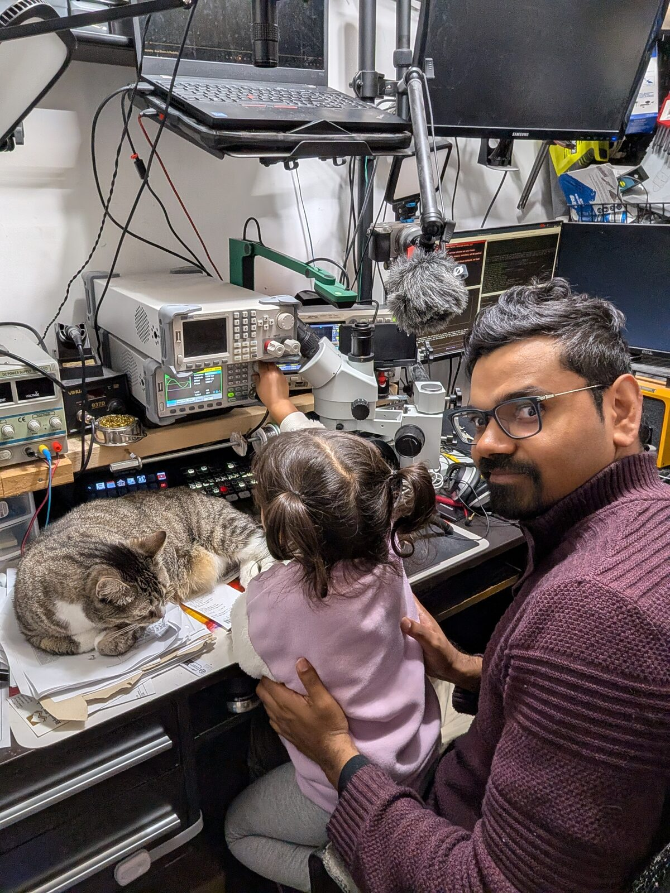

# 🌍 ANTSHIV ROBOTICS
## **Intelligent Systems for Bio-Diversity Conservation & Ecological Monitoring**

> Deploying embedded intelligence where it matters most — understanding and protecting ecosystems.

**🧭 Mission**

Most conservation monitoring today relies on human observers (expensive, limited scale) or satellites (delayed, low resolution).
I’m building autonomous systems that bridge this gap — intelligent platforms for continuous, real-time ecological observation, powered by embedded AI.

Every subsystem I build — from CPU-based transformers to flight controllers — feeds this mission. Each prototype is a stepping stone toward field-deployable conservation systems.

---

## 🎯 Current Technical Focus

**🌿 Ecological Monitoring & Biodiversity Conservation**
The mission. TDR and EM soil probes, biodiversity sensors, and real-time environmental monitoring. Complete pipeline from embedded firmware → edge inference → cloud dashboards. Hardware design, sensor networks, and data federation for conservation deployments. *Accelerating soon with specific field applications.*

**🚁 Autonomous Aerial Platforms**
Real-time INS, quaternion mathematics, Kalman filtering, and control systems (PID/LQR/MPC) for autonomous flight. Modular attitude math and estimator stack portable from OpenGL/ImGui simulation rigs to NRF-based avionics hardware. *Enables continuous aerial monitoring at scale.*

**⚡ Embedded AI Inference**
Proving transformers can run on microcontrollers without GPU clusters or framework dependencies. Hand-optimized kernels in pure C with cache-aware layouts, vectorized operations, and streaming-friendly schedulers. First-principles implementation from scratch. *Enables on-device species identification in the field.*

**☁️ Antsand Platform: Sensors → Dashboards**
[**Antsand**](https://www.antsand.com) is my proprietary SaaS platform with a custom DSL for rapid UI generation—from blogs to mission-critical field command centers. Templated dashboards, federated deployment, and real-time data orchestration. *Connects remote sensor networks to conservation decision-makers.*

---

## 💭 How I Think

I am a contrarian by nature and prefer depth over hype. Gaps in my knowledge make me uneasy, which forces me to strip away abstractions and understand mechanics from first principles—C is my tool of choice for this. I'm comfortable reading datasheets, solving problems from source truth, and moving seamlessly across the stack from low-level C/HPC to Javascript/HTML/CSS. I use 3D printing to rapidly move from idea to prototype. This tinkering mindset and polymath approach help me see through abstractions in ways that lead to unconventional solutions.

I run Linux/AwesomeWM and prefer NXP, TI, and Nordic MCUs. Datasheet fluency means I'm not limited to Arduino/ESP32/Raspberry Pi just because they're popular—I can evaluate compute requirements and pick the right chip. When I do use Arduino, I typically write C in Microchip IDE and link to Arduino libraries rather than use the IDE.

My repositories reflect this philosophy: lots of C code, AI augmentation, and first-principles approaches. Feel free to explore.

**A quick lab tour:** One of my hidden talents is optimizing space. The illustration above shows my closet lab—4×7 ft containing 3-4 monitors, dual laptops (Windows + Linux), 3D printer, Akro-Mils storage for electronics, microscope, soldering station, oscilloscope, signal generator, and a multi-angle YouTube capture setup. I use vertical shelving to maximize surface volume. I also love woodworking, so my miter saw and tools live on a pegboard in the same space.

---

## 💡 Philosophy

**"Memory, cache, and registers are a canvas. I paint with hardware, not just libraries."**

> **Abstraction has a cost.** I pay it consciously.
> **Understanding > Convenience.** First principles before frameworks.
> **Hardware-first thinking.** Know the silicon before you abstract it.

This isn't dogma—it's survival in the field:
- Remote deployment demands efficiency (every watt counts)
- Long-term autonomy requires debuggability (field tech needs a multimeter, not stack traces)
- Conservation biologists need explainable intelligence (not just "the model said so")

No black boxes where it matters. Fast, explainable, embedded intelligence.
---

## 🛠️ Current Build Stack
- **INS & Flight Controller** — quaternion math, complementary/Kalman estimators, first-principles dynamics, PID/LQR control loops, and an OpenGL+ImGui HMVC visualization rig.
- **Antsand Federated Runtime (proprietary)** — templated command center that generates operator UIs, syncs federated data, and deploys mission tooling to field nodes.
- **Mission Analytics Layer** — telemetry ingestion, replay, and anomaly detection bridging embedded logs with Antsand dashboards.
- **Ecological Sensor Tooling** — embedded TDR probes and biodiversity nodes that feed into the same autonomy stack for conservation deployments.
- **Benchmark Harness** — repeatable CPU-side benchmarking for transformer kernels, cache tracing, and AMX/AVX workload characterization.
- **Hardware Targets** — primarily NXP, Texas Instruments, Nordic Semiconductor (nRF52/nRF53), with supplemental Arduino prototypes; development on Linux (main) and Windows (as needed).
- **Physical Test Rigs** — `ThrustStand/` for propulsion characterisation and `DroneTestRig/` for multi-axis mounting; both feed data back into `AeroDynControlRig` for controller tuning.

## 🗺️ Roadmap Highlights
1. Stage 0–1: Quaternion sandbox, first-order dynamics explorer (completed).
2. Stage 2–3: Flight controllers + estimator diagnostics (in progress).
3. Stage 4–5: Full INS orchestration, 3D mission simulation, wind/disturbance modeling (up next).
4. Deployment: NRF53 avionics integration, Antsand-driven field UI, and ecological monitoring pilots.

## 🤝 Working With Me

**ANTSHIV ROBOTICS** is currently a solo operation with company-scale output through AI-augmented development. I build foundational capability piece by piece, accelerating into deployed conservation applications as opportunities arise.

**Open to:**
- **Contract work** on hard embedded/AI problems (especially conservation-adjacent)
- **Collaborations** with shared philosophy (understand first, abstract when necessary)
- **Field deployments** in challenging environments (remote, power-constrained, long-term autonomy)
- **Conservation partnerships** where embedded intelligence can make a measurable impact

**Not interested in:**
- Framework-first thinking or "let's just use PyTorch/ROS"
- Solutions looking for problems
- Black boxes I can't debug in the field

---

## 📺 Connect

- 🎥 **YouTube**: Flight controller deep-dives, sensor builds, and embedded AI walkthroughs → [@Antshiv Robotics](https://www.youtube.com/@antshivrobotics)
- 💬 **Discord**: Real-time discussions on C optimization, drone dynamics, and hardware choices → [Join here](https://discord.gg/bH34RuG2)
- 🌐 **Antsand Platform**: [antsand.com](https://www.antsand.com)
