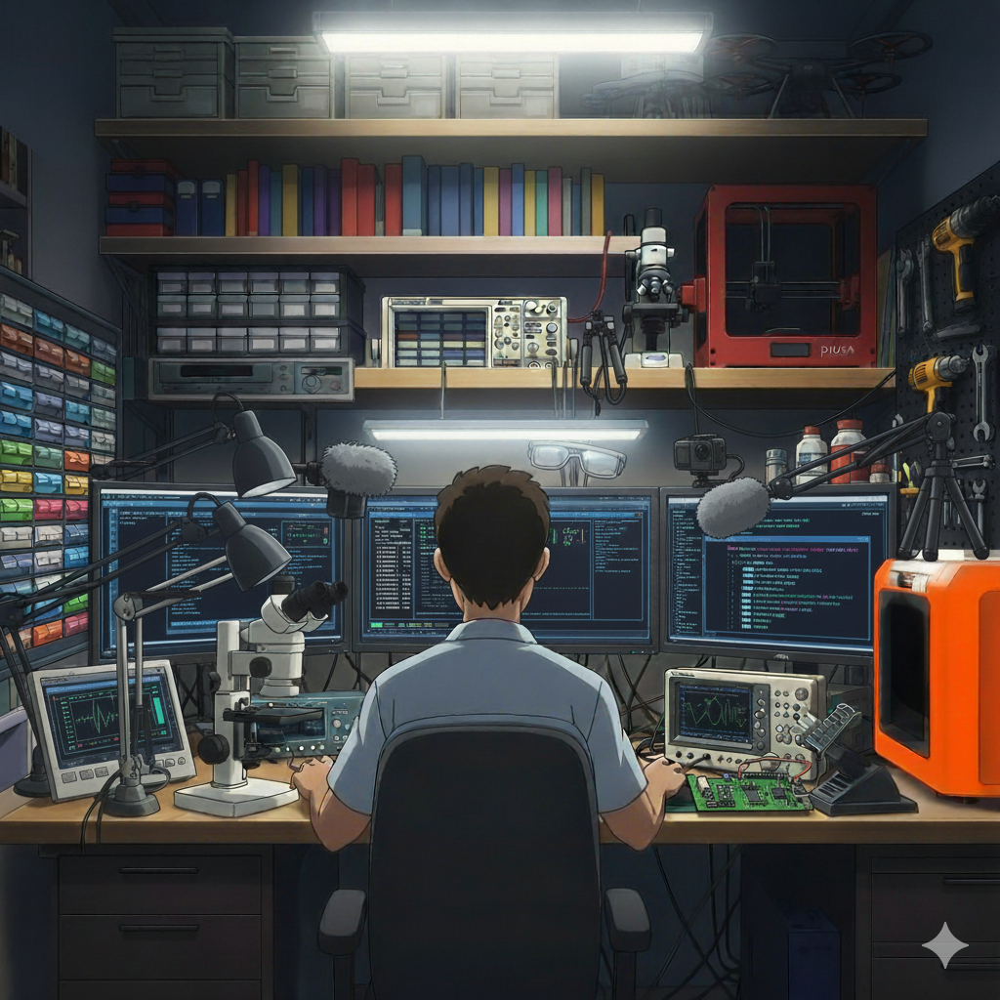

# 🚀 High-Performance Embedded AI & Autonomous Systems

I am a contrarian by nature and prefer depth over hype. I feel uneasy when there are gaps in my knowledge, which forces me to remove abstractions as much as I can to understand the mechanics. C is my preferred language when it comes to depth.

I prefer tinkering and am generally comfortable reading datasheets and solving problems from the source of truth. I like 3D printing, which helps me move from idea to prototype. I consider myself a polymath in some shape or form and genuinely can move across the stack from C, HPC to writing Javascript, HTML and CSS seamlessly. This depth and tinkering nature generally help me see things in a contrarian way as it helps me see through abstractions.

I would like to connect all my projects towards the higher mission of ecological monitoring and biodiversity conservation, though the details of my projects are generally more technical on the surface and in its depth. I am generally focused on HPC, high performance compute, A.I, embedded systems, sensor design and creating tools and SaaS products. [Antsand](https://www.antsand.com) is one of them. My Thrust Stand, Drone Test Rig, C-Transformer, and my proprietary SaaS application Antsand and my flight controller algorithms are all examples of this.

Antsand is a proprietary frontend generation platform built on a simple insight: if you can programmatically generate and deploy websites, the same abstraction can generate mission dashboards, control surfaces, or any interface you need. I built it because existing website builders felt limiting for my blog and landing pages, but the architecture—templated UI generation + federated deployment—turned out to be exactly what I needed for field command interfaces and real-time robotics orchestration. Same underlying engine, different applications. It's now becoming the unified frontend layer across all my embedded projects.

Linux is my operating system of choice, using the AwesomeWM. I prefer to use NXP, TI, and Nordic MCUs and am not constrained by what is popular because I am very comfortable reading datasheets, removing barriers most may have. This means I don't have to use Arduino, ESP32, or Raspberry Pi just because they are easy to use. I can generally think through compute and get a sense of how it may fit in my application. Though I do use Arduino a lot, I generally write in C using the Microchip IDE and compile and link to the existing Arduino C code.

In my repositories, you will find a lot of C code and AI augmentation that resonates with my way of thinking. Feel free to explore and have fun.

One of my hidden useless talents is optimizing space. The illustration above is a good example of my lab. I work from a closet lab with 3-4 monitors, 2 laptops (one running Windows and one Linux), a 3D printer, a lot of Akro-Mils and other storage to store my electronics, a microscope, soldering station, oscilloscope, signal generator and a YouTube setup to capture different camera angles all in a 4x7 ft closet. I utilize height with shelves to maximize space using the surface volume available. And I also love woodworking, so I have all my miter saw and woodworking tools all in this closet placed on a pegboard.

---

## 🎯 Focus
- ⚡ **CPU Transformer Optimization**  
  Delivering order-of-magnitude speedups via cache-aware layouts, vectorized kernels, and streaming-friendly schedulers.
- 🧠 **Heterogeneous Edge Compute**  
  Harnessing ARM, DSP, and C7x cores (e.g., TDA4VM) for real-time inference and sensor fusion.
- 🚁 **Flight Control & INS (C/C++)**  
  Modular attitude math, estimator stack (complementary → EKF), dynamics, controllers, and INS pipelines portable from OpenGL/ImGui sim rigs to NRF-based avionics.
- ☁️ **Antsand Command Platform**  
  Proprietary federated runtime for building control surfaces, templated mission dashboards, and field command centers that deploy to laptops, tablets, and edge nodes.

---

## 💡 Philosophy
> **First Principles > Frameworks**  
> **C Optimization > Abstraction Layers**  
> **Hardware-Aware > Generic AI**

No black boxes. No excuses. Just fast, explainable, embedded intelligence.
---

## 🛠️ Current Build Stack
- **INS & Flight Controller** — quaternion math, complementary/Kalman estimators, first-principles dynamics, PID/LQR control loops, and an OpenGL+ImGui HMVC visualization rig.
- **Antsand Federated Runtime (proprietary)** — templated command center that generates operator UIs, syncs federated data, and deploys mission tooling to field nodes.
- **Mission Analytics Layer** — telemetry ingestion, replay, and anomaly detection bridging embedded logs with Antsand dashboards.
- **Ecological Sensor Tooling** — embedded TDR probes and biodiversity nodes that feed into the same autonomy stack for conservation deployments.
- **Benchmark Harness** — repeatable CPU-side benchmarking for transformer kernels, cache tracing, and AMX/AVX workload characterization.
- **Hardware Targets** — primarily NXP, Texas Instruments, Nordic Semiconductor (nRF52/nRF53), with supplemental Arduino prototypes; development on Linux (main) and Windows (as needed).
- **Physical Test Rigs** — `ThrustStand/` for propulsion characterisation and `DroneTestRig/` for multi-axis mounting; both feed data back into `AeroDynControlRig` for controller tuning.

## 🗺️ Roadmap Highlights
1. Stage 0–1: Quaternion sandbox, first-order dynamics explorer (completed).
2. Stage 2–3: Flight controllers + estimator diagnostics (in progress).
3. Stage 4–5: Full INS orchestration, 3D mission simulation, wind/disturbance modeling (up next).
4. Deployment: NRF53 avionics integration, Antsand-driven field UI, and ecological monitoring pilots.

## 📺 ANTSHIV ROBOTICS
- 🔬 **Research**: Ongoing
- 🎥 **YouTube**: [@Antshiv Robotics](https://www.youtube.com/@antshivrobotics)
- 💬 **Join the Discord**: [https://discord.gg/bH34RuG2](https://discord.gg/bH34RuG2)
- 🤝 **Open to collaboration**: Embedded AI, robotics, high-performance inference
